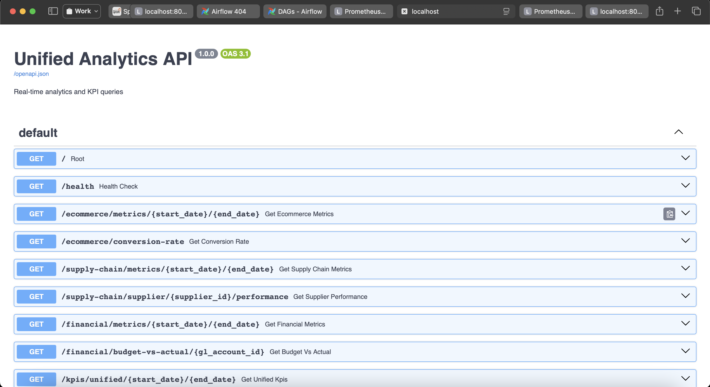
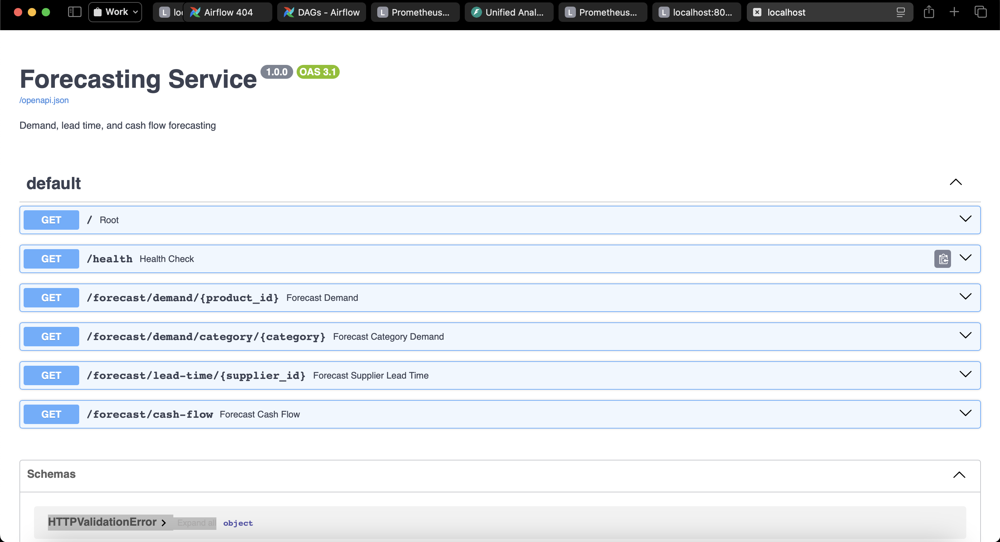
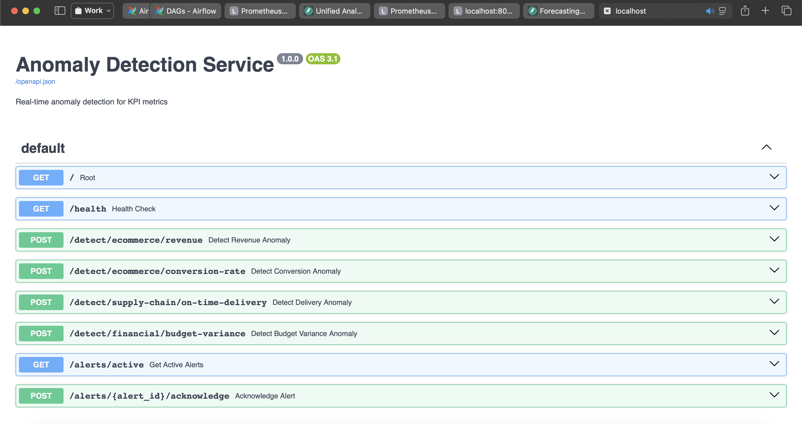
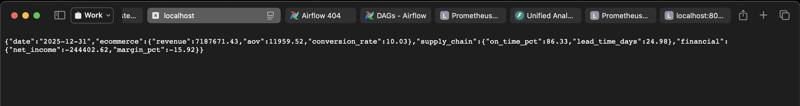
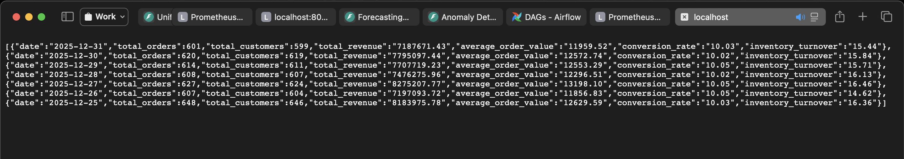
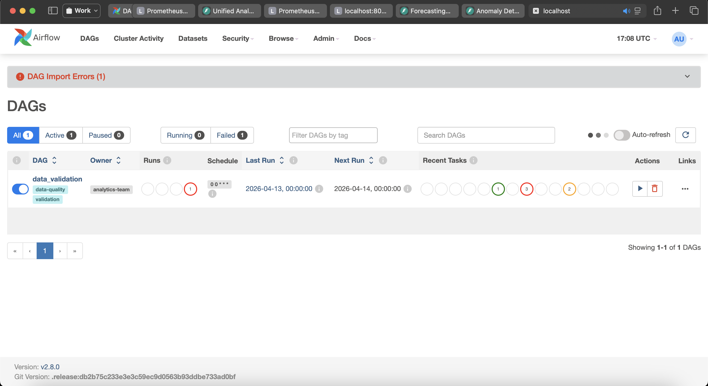
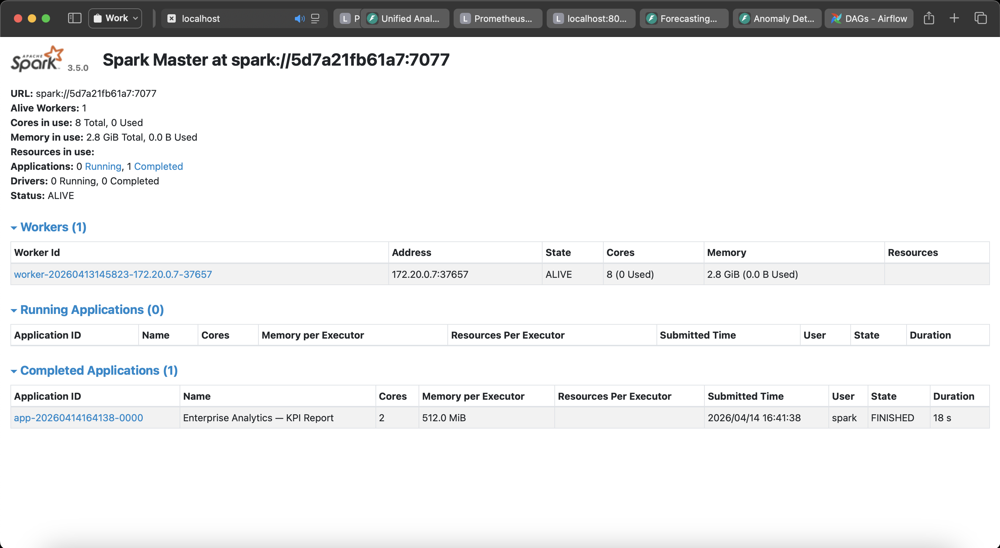
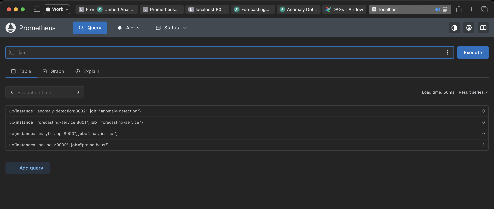

# Enterprise Analytics Platform

A unified, production-grade analytics platform combining E-Commerce, Supply Chain, and Financial Intelligence — built on Apache Spark, Airflow, Kafka, PostgreSQL, and FastAPI microservices, all orchestrated with Docker Compose.

---

## Architecture

```
┌─────────────────────────────────────────────────────────────────┐
│                     Data Sources (Kafka)                        │
│         Orders · Deliveries · Transactions · Inventory          │
└───────────────────────────┬─────────────────────────────────────┘
                            │
┌───────────────────────────▼─────────────────────────────────────┐
│              Apache Airflow (Orchestration)                      │
│         DAG scheduling · Data quality checks · ETL runs         │
└───────────────────────────┬─────────────────────────────────────┘
                            │
┌───────────────────────────▼─────────────────────────────────────┐
│              Apache Spark (Processing)                           │
│     Batch aggregations · ML forecasting · Anomaly scoring        │
└───────────────────────────┬─────────────────────────────────────┘
                            │
┌───────────────────────────▼─────────────────────────────────────┐
│          PostgreSQL Data Warehouse (391 MB, live)                │
│  Dimension tables · Fact tables · Analytics marts · Staging      │
└──────────┬──────────────────────┬────────────────────┬──────────┘
           │                      │                    │
    ┌──────▼──────┐     ┌─────────▼──────┐   ┌────────▼────────┐
    │ Analytics   │     │  Forecasting   │   │    Anomaly      │
    │    API      │     │   Service      │   │   Detection     │
    │  :8000      │     │    :8001       │   │    :8002        │
    └─────────────┘     └────────────────┘   └─────────────────┘
           │
    ┌──────▼──────┐
    │ Prometheus  │
    │    :9090    │
    └─────────────┘
```

---

## Services

| Service | URL | Description |
|---|---|---|
| Analytics API | http://localhost:8000/docs | KPI queries — e-commerce, supply chain, financial |
| Forecasting Service | http://localhost:8001/docs | Demand, lead-time & cash-flow forecasting |
| Anomaly Detection | http://localhost:8002/docs | Statistical anomaly alerts across all domains |
| Apache Airflow | http://localhost:8080 | DAG scheduling & pipeline orchestration |
| Apache Spark | http://localhost:8082 | Distributed processing cluster |
| Prometheus | http://localhost:9090 | Metrics collection & monitoring |
| Kafka | localhost:9092 | Real-time event streaming |
| PostgreSQL | localhost:5432 | Central data warehouse |

---

## Screenshots

### Analytics API — 9 Endpoints via Swagger UI
Unified KPI queries across e-commerce, supply chain, and financial domains.



---

### Forecasting Service — Demand, Lead Time & Cash Flow
ARIMA and linear regression models exposed as REST endpoints.



---

### Anomaly Detection Service — Z-Score Alerts
Real-time statistical anomaly detection across all KPI domains.



---

### Live KPI Summary Response — December 31, 2025
`GET /kpis/summary` — Revenue $7.19M · AOV $11,959 · On-time 86.33% · Lead time 24.98 days



---

### E-Commerce Daily Metrics — December 2025
`GET /ecommerce/metrics/2025-12-25/2025-12-31` — ~620 orders/day · $7–8M revenue/day · 10% conversion



---

### Apache Airflow v2.8.0 — DAG Orchestration
`data_validation` DAG active · scheduler running · auto-refresh enabled



---

### Apache Spark Master — KPI Report Job Completed
1 worker · 8 cores · 2.8 GB memory · `Enterprise Analytics — KPI Report` finished in 18s



---

### Prometheus — 4 Services Scraped
Targets: `anomaly-detection:8002` · `forecasting-service:8001` · `analytics-api:8000` · `prometheus:9090`



---

## Data Warehouse

**391 MB of live data** loaded across all tables:

| Table | Rows | Description |
|---|---|---|
| `public.fact_orders` | 1,000,000 | E-commerce order transactions |
| `public.fact_transactions` | 500,000 | Financial GL transactions |
| `public.fact_deliveries` | 200,000 | Supply chain delivery records |
| `public.dim_customers` | 100,000 | Customer dimension |
| `public.dim_products` | 10,000 | Product catalogue |
| `public.dim_suppliers` | 500 | Supplier dimension |
| `public.dim_gl_accounts` | 200 | Chart of accounts |
| `public.dim_dates` | 1,461 | Date dimension (2022–2025) |
| `analytics.ecommerce_daily_metrics` | 1,461 | Daily e-commerce KPIs |
| `analytics.supply_chain_daily_metrics` | 1,461 | Daily supply chain KPIs |
| `analytics.financial_daily_metrics` | 1,461 | Daily financial KPIs |
| `analytics.unified_kpi_metrics` | 1,461 | Cross-domain unified KPIs |

### Schema

```
public schema          analytics schema
├── dim_dates          ├── ecommerce_daily_metrics
├── dim_customers      ├── supply_chain_daily_metrics
├── dim_products       ├── financial_daily_metrics
├── dim_suppliers      └── unified_kpi_metrics
├── dim_gl_accounts
├── fact_orders
├── fact_deliveries
├── fact_transactions
└── fact_budget_actuals
```

---

## Quick Start

### Prerequisites
- Docker Desktop
- Docker Compose

### Run

```bash
git clone https://github.com/atharvadevne123/Enterprise-Analytics-Platform.git
cd Enterprise-Analytics-Platform
docker compose up -d
```

Wait ~60 seconds for Airflow to initialise, then visit the services above.

### Load sample data (391 MB)

```bash
docker cp generate_data.py analytics-api:/tmp/generate_data.py
docker exec analytics-api python3 /tmp/generate_data.py
```

---

## API Endpoints

### Analytics API (`:8000`)

| Method | Endpoint | Description |
|---|---|---|
| GET | `/kpis/summary` | Latest KPIs across all domains |
| GET | `/ecommerce/metrics/{start}/{end}` | Daily e-commerce metrics |
| GET | `/ecommerce/conversion-rate` | Conversion rate stats |
| GET | `/supply-chain/metrics/{start}/{end}` | Supply chain KPIs |
| GET | `/supply-chain/supplier/{id}/performance` | Single supplier scorecard |
| GET | `/financial/metrics/{start}/{end}` | Financial P&L metrics |
| GET | `/financial/budget-vs-actual/{account}` | Budget variance |
| GET | `/kpis/unified/{start}/{end}` | Cross-domain unified KPIs |

### Forecasting Service (`:8001`)

| Method | Endpoint | Description |
|---|---|---|
| GET | `/forecast/demand/{product_id}` | Product demand forecast |
| GET | `/forecast/demand/category/{category}` | Category-level forecast (ARIMA) |
| GET | `/forecast/lead-time/{supplier_id}` | Supplier lead time forecast |
| GET | `/forecast/cash-flow` | Cash flow forecast |

### Anomaly Detection (`:8002`)

| Method | Endpoint | Description |
|---|---|---|
| POST | `/detect/ecommerce/revenue` | Revenue anomaly (Z-score) |
| POST | `/detect/ecommerce/conversion-rate` | Conversion anomaly |
| POST | `/detect/supply-chain/on-time-delivery` | Delivery anomaly |
| POST | `/detect/financial/budget-variance` | Budget variance alert |
| GET | `/alerts/active` | All active alerts |

---

## Sample Output — Spark KPI Report

```
E-COMMERCE — Last 90 Days (2025-Q4)
+------------+------------+------+----------+---------+
| date       | revenue    |orders| aov      |conv_rate|
+------------+------------+------+----------+---------+
| 2025-12-31 | 7,187,671  | 601  | 11,959   | 10.03   |
| 2025-12-30 | 7,795,097  | 620  | 12,572   | 10.02   |
| 2025-12-29 | 7,707,719  | 614  | 12,553   | 10.05   |
| 2025-12-06 | 8,574,303  | 649  | 13,211   | 10.03   |
+------------+------------+------+----------+---------+
Q4 Total Revenue: $705,682,019   Avg Conversion: 10.03%

SUPPLY CHAIN — Last 90 Days
+------------+----------+---------+-------------+-------------+
| date       |deliveries|on_time% |avg_lead_days|quality_score|
+------------+----------+---------+-------------+-------------+
| 2025-12-31 |   139    |  86.33  |    25.0     |    97.12    |
| 2025-12-30 |   139    |  87.05  |    24.6     |    97.84    |
+------------+----------+---------+-------------+-------------+
```

---

## Tech Stack

| Layer | Technology |
|---|---|
| Streaming | Apache Kafka 7.6 + Zookeeper |
| Processing | Apache Spark 3.5 (master + worker) |
| Orchestration | Apache Airflow 2.8 |
| Warehouse | PostgreSQL 15 |
| APIs | FastAPI + Uvicorn (Python 3.11) |
| ML | scikit-learn, statsmodels, ARIMA |
| Monitoring | Prometheus |
| Containers | Docker Compose |

---

## Project Structure

```
Enterprise-Analytics-Platform/
├── airflow/
│   ├── dags/                  # Airflow DAG definitions
│   └── logs/
├── data/
│   ├── warehouse_schema.sql   # Full warehouse DDL
│   └── airflow_db_init.sql    # Airflow metadata DB init
├── docker/
│   └── Dockerfile.services    # Multi-stage build for microservices
├── docs/
│   └── images/                # Screenshots
├── monitoring/
│   └── prometheus.yml         # Prometheus scrape config
├── services/
│   ├── analytics_api.py       # Analytics API microservice
│   ├── forecasting_service.py # Forecasting microservice
│   └── anomaly_detection.py   # Anomaly detection microservice
├── spark/                     # Spark job definitions
├── docker-compose.yml
└── requirements.services.txt
```
